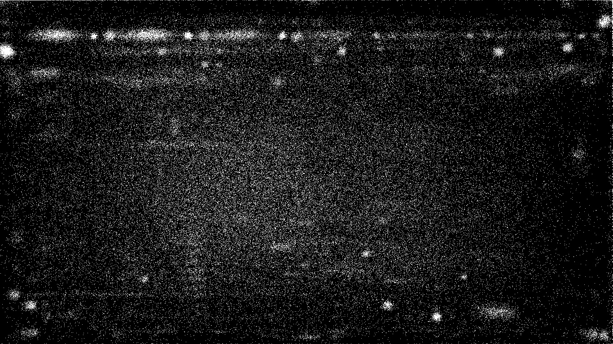

# Mouse Daemon

A Linux daemon that logs the pointer's position at every click.

## Getting Started

These instructions will get you a copy of the project up and running on your local machine for development and testing purposes.

### Prerequisites

To compile this code you need
-  gcc
- X library
- Any linux distribution (tested only on Debian GNU/Linux 9 (stretch) 64-bit)

### Installing

Compile the C code as usual and include the -X lib using -lX11 command

```
gcc -lX11 -o mouse_daemon mouse_daemon.c
```
Change the file permission

```
chmod 0755 mouse_daemon
```

After compiling you need to move the binary file in any folder (use one that you don't use frequently)

```
mv ./mouse_daemon /usr/bin
```

Sometime the daemon is not able to create the log file, this can be solved using

```
touch /var/log/mouse.log
chmod 0666 /var/log/mouse.log
```

Now lets make this daemon start at the login, modify the ~/.profile (or ~/.bashrc ) file by adding
the following line at the end

```
/usr/bin/mouse_daemon
```

## Running the tests

Reboot the pc and complete the login.
After that the mouse should have been started
You can check it by checking the daemon.log file

```
tail /var/log/daemon.log
```

or 

```
cat /var/log/daemon.log | grep mouse_daemon
```

should appear something like: 

```
Jul 11 23:45:17 debian mouse_daemon[1155]: started.
```

You can also check if the daemon is running by checking the list of current running processes

```
ps -aux | mouse_daemon
```

### Test

To test the daemon you need to check the tail of the mouse.log file

```
tail /var/log/mouse.log
```

After some click the file should change.


### Output

 
This image shows the most used portions of the screen. The data have been collected by the deamon running on a Debian 9 linux distribution for 3 months.
Notice the 3 most clicked areas
- top left corner, in witch the applicaiton menu (start button) is located
- the left icon of the menu, where the menu categories are
- the browser tabs along the top.

## Built With

* [X library](https://www.x.org/)

## Authors

Antonio Gaetano "Tony" Barletta

## License

This project is licensed under the MIT License - see the [LICENSE.md](LICENSE.md) file for details


